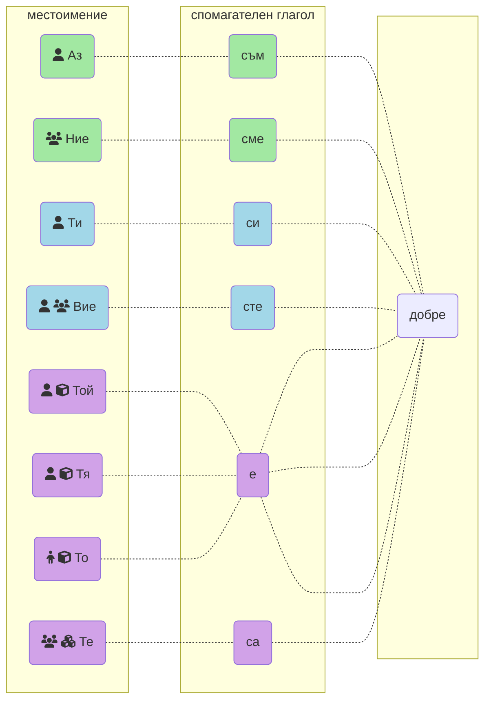
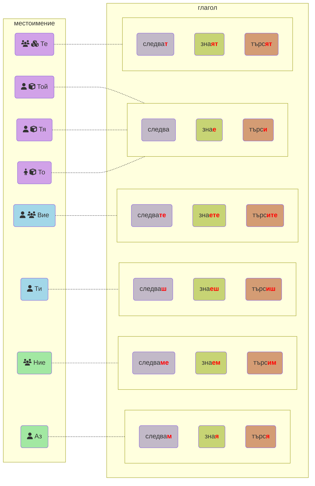

```mermaid
flowchart LR
    classDef first fill:#a2e8a2;
    classDef second fill:#a2d7e8;
    classDef third fill:#d1a2e8;

    subgraph A ["#160; местоимение #160;"]
      direction LR
      A1(fa:fa-user Аз)
      A2(fa:fa-users Ние)
      A3(fa:fa-user Ти)
      A4(fa:fa-user fa:fa-users Вие)
      A5(fa:fa-user fa:fa-cube Той)
      A6(fa:fa-user fa:fa-cube Тя)
      A7(fa:fa-child fa:fa-cube То)
      A8(fa:fa-users fa:fa-cubes Те)
    end

    subgraph B ["#160; спомагателен глагол #160;"]
      direction LR
      B1(съм)
      B2(сме)
      B3(си)
      B4(сте)
      B5(е)
      B8(са)
    end

    class A1,A2,B1,B2 first;
    class A3,A4,B3,B4 second;
    class A5,A6,A7,A8,B5,B8 third;

    subgraph C ["#160;"]
      direction LR
      C1(добре)
    end

    A1-..-B1
    A2-.-B2
    A3-.-B3
    A4-.-B4
    A5-.-B5
    A6-.-B5
    A7-.-B5
    A8-.-B8

    B1-..-C1
    B2-.-C1
    B3-.-C1
    B4-.-C1
    B5-.-C1
    B5-.-C1
    B5-.-C1
    B8-.-C1
```

```mermaid
flowchart LR
    classDef first fill:#a2e8a2;
    classDef second fill:#a2d7e8;
    classDef third fill:#d1a2e8;

    classDef grA fill:#c2b9c8;
    classDef grE fill:#c7d474;
    classDef grI fill:#d49c74;

    subgraph A ["#160; местоимение #160;"]
      direction LR
      A1(fa:fa-user Аз)
      A2(fa:fa-users Ние)
      A3(fa:fa-user Ти)
      A4(fa:fa-user fa:fa-users Вие)
      A5(fa:fa-user fa:fa-cube Той)
      A6(fa:fa-user fa:fa-cube Тя)
      A7(fa:fa-child fa:fa-cube То)
      A8(fa:fa-users fa:fa-cubes Те)
    end

    subgraph B ["#160; глагол #160;"]
        subgraph gr1 [" "]
            grA1(следва<span style='color:red'><b>м</b></span>)
            grE1(зна<span style='color:red'><b>я</b></span>)
            grI1(търс<span style='color:red'><b>я</b></span>)
        end
        subgraph gr2 [" "]
            grA2(следва<span style='color:red'><b>ме</b></span>)
            grE2(зна<span style='color:red'><b>ем</b></span>)
            grI2(търс<span style='color:red'><b>им</b></span>)
        end
        subgraph gr3 [" "]
            grA3(следва<span style='color:red'><b>ш</b></span>)
            grE3(зна<span style='color:red'><b>еш</b></span>)
            grI3(търс<span style='color:red'><b>иш</b></span>)
        end
        subgraph gr4 [" "]
            grA4(следва<span style='color:red'><b>те</b></span>)
            grE4(зна<span style='color:red'><b>ете</b></span>)
            grI4(търс<span style='color:red'><b>ите</b></span>)
        end
        subgraph gr5 [" "]
            grA5(следва)
            grE5(зна<span style='color:red'><b>е</b></span>)
            grI5(търс<span style='color:red'><b>и</b></span>)
        end
        subgraph gr8 [" "]
            grA8(следва<span style='color:red'><b>т</b></span>)
            grE8(зна<span style='color:red'><b>ят</b></span>)
            grI8(търс<span style='color:red'><b>ят</b></span>)
        end
    end

    class A1,A2,B1,B2 first;
    class A3,A4,B3,B4 second;
    class A5,A6,A7,A8,B5,B8 third;

    class grA1,grA2,grA3,grA4,grA5,grA8 grA;
    class grE1,grE2,grE3,grE4,grE5,grE8 grE;
    class grI1,grI2,grI3,grI4,grI5,grI8 grI;

    A1-..-gr1
    A2-.-gr2
    A3-.-gr3
    A4-.-gr4
    A5-.-gr5
    A6-.-gr5
    A7-.-gr5
    A8-.-gr8
```
