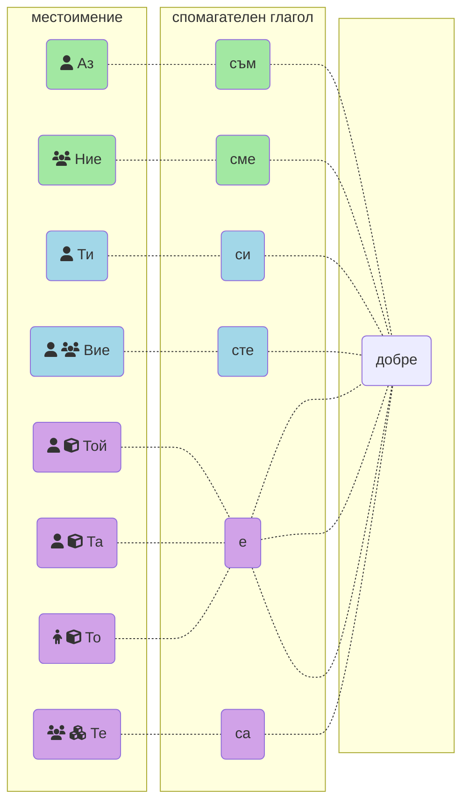

```mermaid
flowchart LR
    classDef first fill:#a2e8a2;
    classDef second fill:#a2d7e8;
    classDef third fill:#d1a2e8;

    subgraph A ["#160; местоимение #160;"]
      direction LR
      A1(fa:fa-user Аз)
      A2(fa:fa-users Ние)
      A3(fa:fa-user Ти)
      A4(fa:fa-user fa:fa-users Вие)
      A5(fa:fa-user fa:fa-cube Той)
      A6(fa:fa-user fa:fa-cube Та)
      A7(fa:fa-child fa:fa-cube То)
      A8(fa:fa-users fa:fa-cubes Те)
    end

    subgraph B ["#160; спомагателен глагол #160;"]
      direction LR
      B1(съм)
      B2(сме)
      B3(си)
      B4(сте)
      B5(е)
      B8(са)
    end

    class A1,A2,B1,B2 first;
    class A3,A4,B3,B4 second;
    class A5,A6,A7,A8,B5,B8 third;

    subgraph C ["#160;"]
      direction LR
      C1(добре)
    end

    A1-.-B1
    A2-.-B2
    A3-.-B3
    A4-.-B4
    A5-.-B5
    A6-.-B5
    A7-.-B5
    A8-.-B8

    B1-.-C1
    B2-.-C1
    B3-.-C1
    B4-.-C1
    B5-.-C1
    B5-.-C1
    B5-.-C1
    B8-.-C1
```
